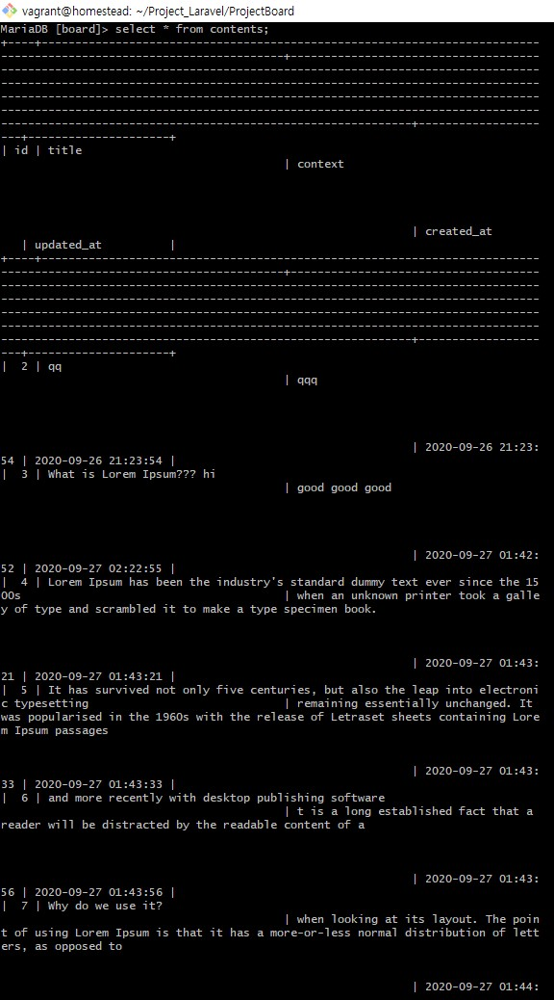

Laravel + Vue SPA + MariaDB + Redis + tdd - Board
===

게시판 기능

- Keyword: Vue, SPA, MariaDB, Redis, TDD
- 개발 기간: 2020.09.14 ~ 2020.09.27

게시판 CRUD 기능 구현하기.

 

개발 환경
---
 - Window10의 Visual Code
 - VirtualBox Vagrant 가상머신의 ubuntu 18.04.5 LTS 버전 운영체제 
 - laravel Framework 8.5.0
 - homestead
 - Vagrant version 2.2.10
 - PHP version 7.4.10
 - composer version 1.10.13
 - MariaDB server version 10.5.5
 - phpRedis
 
 

샘플 화면
---
CRUD 기능

| Create: 게시글 생성 |
|:----------------------------------------:|
||

| Read: 상세글 읽기 |
|:----------------------------------------:|
||

| Update: 게시글 수정 |
|:----------------------------------------:|
||

| Delete: 글 삭제 |
|:----------------------------------------:|
||

 

DataBase
---
- Migration
  - php artisan migrate를 통해 테이블 스키마 마이그레이션 했습니다.
  - /database/migrations/2020_09_19_000000_create_contents_table.php 파일은 마이그레이션 파일입니다.

- MariaDB
  - 데이터베이스 이름: board, 테이블 이름: contents
  - 테이블 레코드 보기
  
  
- Redis 저장소
  - Redis::setex를 사용하여 임의로 180초만 레디스 저장소에 데이터들 저장합니다.
  - Redis::get을 통해 레디스 저장소에 데이터 키값이 존재하면 value값을 가져옵니다.
  - 레디스 저장소에 json 데이터로 저장했습니다.
  - 사용한 이유: 게시판을 새로고침해서 볼때마다 모든 리스트들을 데이터베이스에 매번 접근해서 가져오는데 레디스 저장소에 저장 해놓고 레디스 저장소에서 데이터를 가져오면 더 빨리 가져올 수 있기 때문입니다. 삽입, 삭제, 수정이 있을때마다 redis 저장소의 값만 최신화 시켜주면 캐시 기능처럼 사용할 수 있다고 생각해서 썼습니다.

| Redis 저장소에 저장 확인 |
|:----------------------------------------:|
||

 

TDD (테스트 주도 개발)
---
/tests/Feature/ContentControllerTest.php 파일에 테스트 메서드 작성 했습니다.
CRUD 기능을 가지고 있는 파일(ContentController.php)을 중점적으로 테스트 했습니다.

Controller 메서드들을 확인한 테스트 수행 결과

 

Vue.js SPA
---
- Componet
  - 컴포넌트는 Board.vue, ContentDetail.vue, Create.vue, Header.vue로 구성되어 있습니다.
  - Header 컴포넌트는 웹페이지 상단에 고정이며 게시판 CRUD 기능 수행시 Board, ContentDetail, Create 컴포넌트만 바꿨습니다.

- Vue-Router
  - routes.js 파일에 라우터들을 선언 해놓고 각 컴포넌트에서 활용했습니다.
  - router.push를 통해 주소로 id값을 주고받을 때 편했습니다.
  
- axios
  - 클라이언트에서 서버간 통신을 하기 위해 사용했습니다.
  - get, post, put, delete 기능을 통해 Controller에 있는 CRUD 기능에 편하게 접근할 수 있었습니다.
  - javascript의 ajax와 비슷한 느낌이며 비동기 처리를 위해 async와 await를 사용했습니다.
  
 
